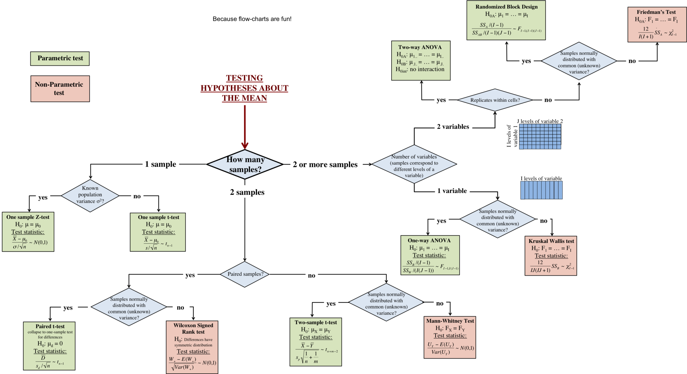

# Project Name: Comprehensive Hypothesis Testing and Analysis with Ecommerce Data
> Here goes your awesome project description!

## Table of contents
* [Project Overview](#project-overview)
* [Statistical Methods](#statistical-methods)
* [Process](#process)
* [Contact](#contact)

## Project Overview
Experimental design and hypothesis testing are widely used not only in scientific research but also in the business world. Businesses need to understand whether certain tactics have significant impact on the results. The purpose of this project is to utilize hypothesis testing to answer real world business questions. 

The data comes from the Northwind Database which is a sample database used by Microsoft to demonstrate the features of some of its products. The database contains the sales data for Northwind Traders, a fictitious specialty foods export/import company.

Business questions answered:

 1) Does discount amount have a statistically significant effect on the quantity of product in an order? If so, at what level(s) of discount?
 2) Does discount amount have a statistically significant effect on the revenue of any category in an order? If so, what category are mostly impacted? 
 3) Does each region generate the same average order revenue? 
 4) Does seasonality have a significant impact on the revenue of any category in an order?

## Statistical Methods

* Central Limit Thereom
* Test for Normality: Kolmogorov-Smirnov Test (KS Test)
* Test for Equality of Variance:  Levene’s Test
* Parametric Tests: 
	- Independent T-Test
	- ANOVA
* Non Parametric Tests: 
	- Kolmogorov-Smirnov Test (KS Test for 2 samples)
	- Mann-Whitney U Test (Nonparametric version of 2-sample t test)
	- Krusal-Wallis H Test (KW Test — Nonparametric version of one-way ANOVA)

## Process
- Data Exploration
- Hypothesis Development
- Hypothesis Test
- Interpret the results

