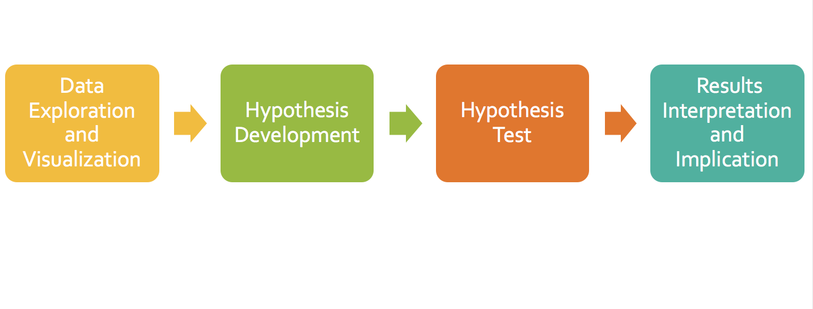

# Project Name: Comprehensive Hypothesis Testing and Analysis with Ecommerce Data

## Table of contents
* [Project Overview](#project-overview)
* [Statistical Methods](#statistical-methods)
* [Project Workflow](#project-workflow)
* [Test Results and Implications](#test-results-and-implications)
* [Next Steps](#next-steps)

## Project Overview
Experimental design and hypothesis testing are widely used not only in scientific research but also in the business world. Businesses need to understand whether certain tactics such as promotion offers, new website design have significant impact on the business results. While we are most familiar with parametric statistical tests like Student's T-Test and ANOVA, non-parametric tests are actually more practical because they don't require strict assumptions on normality. The purpose of this project is to utilize different hypothesis tests to answer real world business questions. 

The data comes from the Northwind Database which is a sample database used by Microsoft to demonstrate the features of some of its products. The database contains the sales data for Northwind Traders, a fictitious specialty foods export/import company.

4 bsiness questions are answered in this project:

 1) Does discount amount have a statistically significant effect on the quantity of product in an order? If so, at what level(s) of discount?
 2) Does discount amount have a statistically significant effect on the revenue of any category in an order? If so, what category are mostly impacted? 
 3) Does each region generate the same average order revenue? 
 4) Does seasonality have a significant impact on the revenue of any category in an order?

## Statistical Methods

* Central Limit Thereom
* Test for Normality: Kolmogorov-Smirnov Test (KS Test)
* Test for Equality of Variance:  Levene’s Test
* Parametric Tests: 
	- Independent T-Test
	- ANOVA
* Non Parametric Tests: 
	- Kolmogorov-Smirnov Test (KS Test for 2 samples)
	- Mann-Whitney U Test (Nonparametric version of 2-sample t test)
	- Krusal-Wallis H Test (KW Test — Nonparametric version of one-way ANOVA)

## Project Workflow

## Database Schema

## Choose the Right Test

## Test Results and Implications

- The presence of Discount leads consumers to buy more quantity per order no matter what levels of discount
- The presence of Discount drives higher revenue for Dairy category
- When there is a Discount and the Discount level is above 5%, consumers tend to spend more on Beverage category
- Not all regions have the same scale of revenue. They can be managed in tiers (small, medium and large)
- Seasonality does not have a significant impact on average order revenue

## Next Steps:
- Test different discount mix and find the optimal point between sales volume and profit
- Deep dive into the performance (profit, logistic, marketing, etc.) of the larger region groups and make sure resources are optimized 
- Specify seasonality or sales season for each region and run similar tests

### [Presentation](https://github.com/bonniema/HypothesisTesting-NorthwindEcommerce/blob/master/HypothesisTesting_Project_Presentation.pptx)

### [Notebook](https://github.com/bonniema/HypothesisTesting-NorthwindEcommerce/blob/master/HypothesisTesting_Project.ipynb)

### [Check out the blog post of this analysis](https://towardsdatascience.com/non-parametric-tests-in-hypothesis-testing-138d585c3548)

